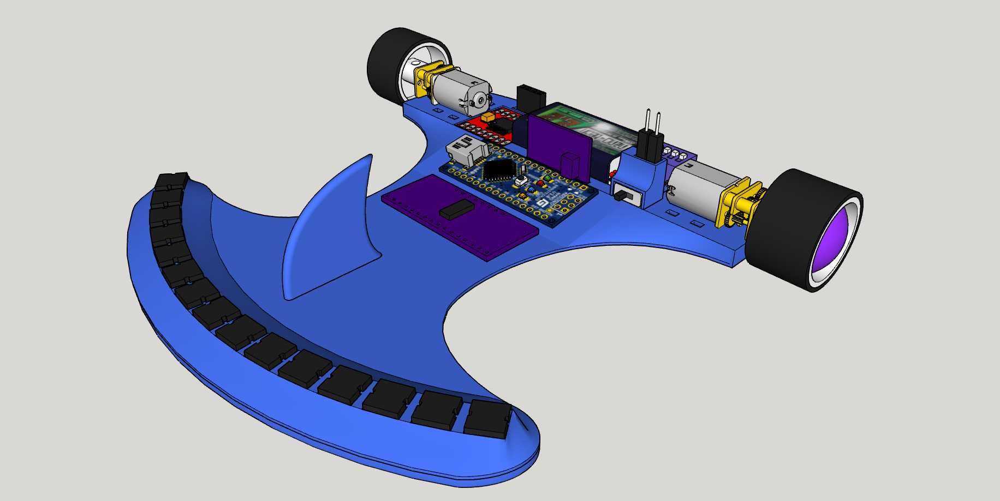

# ShyarlyBot

Robot siguelíneas multifunción: rastreador, línea y degradado

## Hardware
- Arduino Nano
- Driver de motores TB6612FNG
- 2x Motores "Pololu" N20 @2000rpm
- DIP Switch 4p
- LiPo 2S ~250 mAh
- 15x Sensores CNY70
- 15x Resistencias 47kΩ
- 15x Resistencias 220Ω
- Goma de ruedas reciclada de una maqueta de un kart
- Chasis completamente impreso en PLA

## Software
- Programado con Arduino IDE y VSCode con PlatformIO
- Funciones de PID y cálculo de posición en la línea
- Disponibles programas de siguelíneas, rastreador y degradado (desuso)